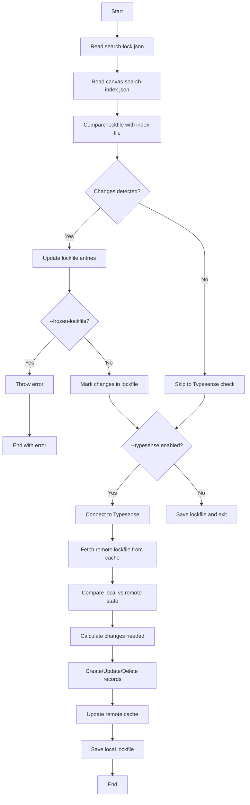
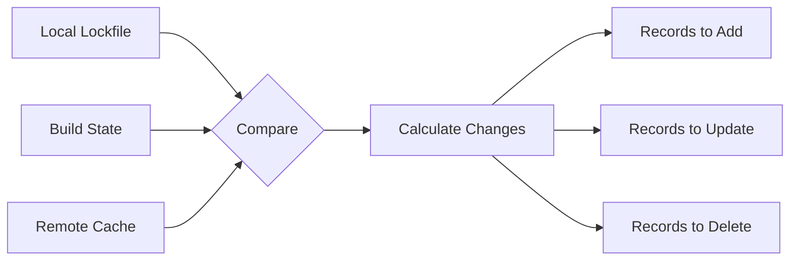

The Search CLI command provides advanced management of search indexes, with specialized support for Typesense. It maintains a lockfile-based system to efficiently track changes and synchronize search indexes between your local build and remote search services.

## Overview

The search CLI builds upon the [custom search indexing](./05-search.mdx) system by providing:

- **Change tracking** via a lockfile system (`search-lock.json`)
- **Incremental updates** to avoid unnecessary reindexing
- **Remote synchronization** with Typesense search servers
- **Conflict detection** between local and remote states
- **Support for both file-based and URL-based search records**

## Command Usage

```bash
# Basic reconciliation (updates lockfile only)
iiif-hss index

# Sync with Typesense
iiif-hss index --typesense

# Check remote URLs for changes
iiif-hss index --check-remote

# Prevent lockfile modifications (CI mode)
iiif-hss index --frozen-lockfile
```

### Command Options

| Option                   | Description                                        |
| ------------------------ | -------------------------------------------------- |
| `--typesense`            | Enable synchronization with Typesense server       |
| `--check-remote`         | Verify remote URL records for changes              |
| `--frozen-lockfile`      | Fail if lockfile would be modified (useful for CI) |
| `--iiif-build-dir <dir>` | Override the build directory path                  |

## Environment Configuration

When using `--typesense`, the following environment variables are required:

```bash
# Typesense server configuration
TYPESENSE_API_KEY=your-admin-api-key
TYPESENSE_HOST=localhost
TYPESENSE_PORT=8108
TYPESENSE_PROTOCOL=http

# Optional: Custom collection name for caching lockfile
TYPESENSE_CACHE_COLLECTION_NAME=search-lock-file

# Optional: Index name mapping (format: "local:remote,local2:remote2")
SEARCH_INDEX_MAPPING=canvas_plaintext:canvases,manifests:manifest_search
```

Alternatively, you can use the `NEXT_PUBLIC_*` prefixed versions of these variables.

## The Lockfile System

The search CLI maintains a `search-lock.json` file in your project root that tracks the state of all search records:

```json
{
  "version": "1.0",
  "lastModified": "2024-01-15T10:30:00.000Z",
  "entries": {
    "manifests/book1": {
      "lastUpdated": "2024-01-15T10:30:00.000Z",
      "combinedHash": "abc123def456",
      "entries": [
        {
          "location": {
            "type": "file",
            "path": "manifests/book1/canvas_0.json"
          },
          "format": "record-json",
          "index": "canvas_plaintext",
          "lastModified": "2024-01-15T10:00:00.000Z",
          "hash": "def789ghi012",
          "manifestId": "manifests/book1",
          "recordId": "manifests/book1/canvas/0"
        }
      ]
    }
  }
}
```

### Lockfile Structure

- **`version`**: Schema version for the lockfile format
- **`lastModified`**: Timestamp of last lockfile update
- **`entries`**: Per-manifest tracking information
  - **`lastUpdated`**: When this manifest was last processed
  - **`combinedHash`**: Combined hash of all entries for this manifest
  - **`entries[]`**: Array of individual search records
    - **`location`**: File path or URL of the search record
    - **`format`**: Format type (`record-json`, `record-jsonl`, `alto-xml`, etc.)
    - **`index`**: Target search index name
    - **`hash`**: Content hash for change detection
    - **`recordId`**: Unique identifier for this record

## Process Flow

The search CLI follows this process:



### Reconciliation Process

1. **Load Lockfile**: Read existing `search-lock.json` or create new one
2. **Read Index File**: Parse `meta/canvas-search-index.json` from build
3. **Compare States**: Check file hashes, modification times, and remote URLs
4. **Mark Changes**: Flag entries that need updating, creating, or deletion
5. **Update Lockfile**: Save new state if not in frozen mode

### Typesense Synchronization

When `--typesense` is enabled:

1. **Connect**: Establish connection using environment variables
2. **Fetch Remote State**: Download current lockfile from Typesense cache collection
3. **Calculate Diff**: Compare local lockfile with remote cached state
4. **Execute Changes**:
   - Create new search collections if needed
   - Add new records to indexes
   - Update modified records
   - Delete removed records
5. **Update Cache**: Save new lockfile state to remote cache collection

## Remote State Cache

The search CLI uses a special Typesense collection to store the remote state of your search indexes. This cache enables efficient change detection and prevents unnecessary updates.

### Cache Collection Structure

The remote cache collection (default name: `search-lock-file`) stores lockfile entries as Typesense documents:

```json
{
  "id": "manifests/book1",
  "manifestId": "manifests/book1",
  "lastUpdated": "2024-01-15T10:30:00.000Z",
  "combinedHash": "abc123def456",
  "version": "1.0",
  "entries": [
    {
      "location": { "type": "file", "path": "manifests/book1/canvas_0.json" },
      "format": "record-json",
      "index": "canvas_plaintext",
      "hash": "def789ghi012",
      "recordId": "manifests/book1/canvas/0"
    }
  ]
}
```

### Change Detection Process

The CLI compares three states to determine what needs updating:

1. **Local Lockfile State**: Current state from `search-lock.json`
2. **Build State**: Generated state from `canvas-search-index.json`
3. **Remote Cache State**: Previous deployment state from Typesense cache



### Cache Collection Schema

The cache collection uses this Typesense schema:

```json
{
  "name": "search-lock-file",
  "enable_nested_fields": true,
  "fields": [
    { "name": "id", "type": "string", "facet": true },
    { "name": "manifestId", "type": "string", "facet": true },
    {
      "name": "lastUpdated",
      "type": "string",
      "facet": true,
      "optional": true
    },
    {
      "name": "combinedHash",
      "type": "string",
      "facet": true,
      "optional": true
    },
    { "name": "version", "type": "string", "facet": true },
    { "name": "entries", "type": "object[]", "facet": true },
    { "name": "rawData", "type": "string", "facet": true }
  ]
}
```

### Benefits of Remote Caching

- **Incremental Updates**: Only changed records are updated, not entire indexes
- **Deployment History**: Previous states are preserved for rollback scenarios
- **Conflict Detection**: Identifies when local and remote states diverge
- **Multi-environment Support**: Different cache collections for different environments
- **Bandwidth Efficiency**: Avoids downloading large search indexes for comparison

### Cache Management

**Viewing Cache State**

```bash
# The cache is automatically managed, but you can inspect it via Typesense API
curl "http://localhost:8108/collections/search-lock-file/documents" \
  -H "X-TYPESENSE-API-KEY: your-api-key"
```

**Custom Cache Collection**

```bash
export TYPESENSE_CACHE_COLLECTION_NAME=my-project-cache
hss search-index --typesense
```

> [!TIP]
>
> **Cache Cleanup** -
> The CLI automatically maintains cache consistency, but you can manually reset by deleting the cache collection through the
> Typesense API if needed.

## Search Record Types

The CLI supports different types of search records:

### File-based Records

```json
{
  "location": { "type": "file", "path": "manifests/book1/canvas_0.json" },
  "format": "record-json",
  "index": "canvas_plaintext"
}
```

### URL-based Records

```json
{
  "location": {
    "type": "remote",
    "url": "https://example.org/book1/record-0.json"
  },
  "format": "record-json",
  "index": "canvas_plaintext",
  "recordId": "manifests/book1/canvas/0"
}
```

### Alto XML Records

```json
{
  "location": {
    "type": "remote",
    "url": "https://example.org/book1/alto-0.xml"
  },
  "format": "alto-xml",
  "index": "canvas_plaintext",
  "canvas": { "w": 2000, "h": 3000 },
  "canvasIndex": 0
}
```

## Error Handling

### Common Errors

**Missing canvas-search-index.json**

```
Error: Canvas index file not found at build/meta/canvas-search-index.json
```

→ Run the build process first to generate search indexes

**Typesense Configuration Missing**

```
Error: Missing Typesense configuration
Please check your environment variables:
- TYPESENSE_API_KEY
- TYPESENSE_HOST
- TYPESENSE_PORT
- TYPESENSE_PROTOCOL
```

→ Set the required environment variables

**Frozen Lockfile Violation**

```
Error: Lock file has changed
```

→ Remove `--frozen-lockfile` flag or commit lockfile changes first

## Best Practices

### Development Workflow

1. **Local Development**: Run `iiif-hss index` after builds to update lockfile
2. **Remote Testing**: Use `iiif-hss index --typesense --check-remote` to verify remote state
3. **CI/CD**: Use `--frozen-lockfile` to ensure consistent deployments

### Performance Optimization

- Use `--check-remote` sparingly as it fetches all remote URLs
- Consider URL-based records for large datasets to avoid local file storage
- Set up appropriate Typesense index mappings to avoid collection name conflicts

### Monitoring

- Check lockfile diffs to understand what changed
- Monitor Typesense collection sizes and update patterns
- Use
  the cache collection to track deployment history

## Integration Examples

### GitHub Actions

```yaml
- name: Update search indexes
  run: |
    iiif-hss build
    iiif-hss index --typesense --frozen-lockfile
  env:
    TYPESENSE_API_KEY: ${{ secrets.TYPESENSE_API_KEY }}
    TYPESENSE_HOST: ${{ vars.TYPESENSE_HOST }}
    TYPESENSE_PORT: ${{ vars.TYPESENSE_PORT }}
    TYPESENSE_PROTOCOL: ${{ vars.TYPESENSE_PROTOCOL }}
```

### Docker Compose

```yaml
services:
  typesense:
    image: typesense/typesense:0.25.0
    environment:
      TYPESENSE_API_KEY: your-api-key
      TYPESENSE_DATA_DIR: /data
    ports:
      - "8108:8108"
    volumes:
      - ./typesense-data:/data
```

The Search CLI aims to provide a robust foundation for managing search indexes at scale - however the lockfile may get very large if there are entries for every canvas.

> [!WARNING]
>
> There are optimisations to be made for large datasets, specifically
> with the lockfile and how it scales with many canvases. Ideally the current format
> would be more compressed (with one url per canvas) but things like the canvas width/height
> and knowing the record ID (so it can be merged from AltoXML) are still challenges that need to be
> overcome.
